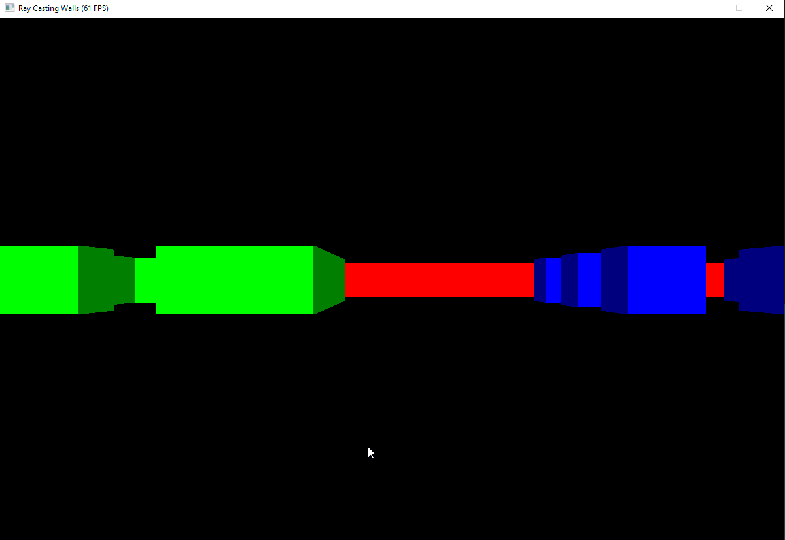

Ray Casting Walls

Show the representation of 3D room using ray casting.
Based on documentation in [Lode's Computer Graphics Tutorial](https://lodev.org/cgtutor/raycasting.html)
Use arrow keys to move arround.

#
