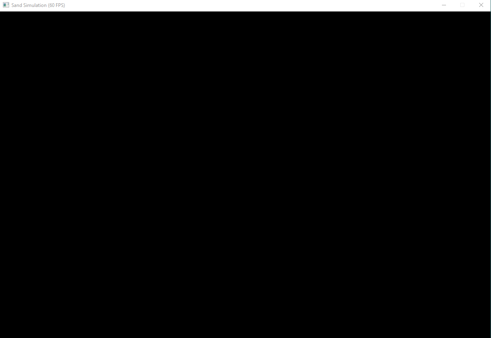

Sand Simulation

The core of a sand simulation program relies on a cellular automata approach.

World Representation:

The world is a 2D grid, where each cell represents one grain of sand.

Particle Movement:

The program iterates through the grid, from top to bottom.
For each element the program checks its surroundings:
If there's an empty space below, the element moves down.
if not then checks the spaces diagonally down-left and down-right to see if it can move there.

Sand generation:

It is done by clicking anywhere in the window, it creates a small cluster of sand that will fall down.

#
