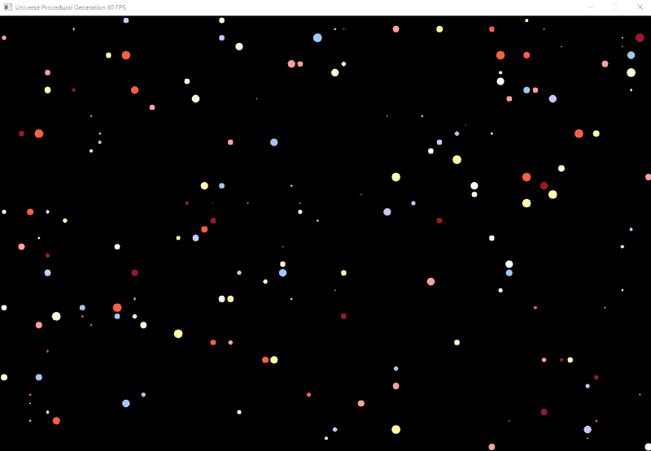

Procedural Generation Example

Based on https://www.youtube.com/watch?v=ZZY9YE7rZJw

This project shows how to generate parts of a world based on a certain number (seed). In this specfic example we simulate sectors of a universe with stars, and each star can have multiple planets and moons. Those properties are generated on demand. 
You can navigate to different sectors by using W, A, S, D keys. Clicking in one of the circles on screen (star) it shows a box with the star's planets and moons. Can be very usefull to generate game worlds.

Couple of things I learned in this project:
- setup a SDL project and basic functions.
- SDL does not have a DrawCircle function, so had to research it. Can be improved in terms of performance.
- SDL also does not have a DrawText function, I have to research and implement something.
- The Lehmer random number generator (https://en.wikipedia.org/wiki/Lehmer_random_number_generator)

Special to thanks javidx9 for its chanel: One Lone Coder where this project is based on. It has many interesting and instructive videos about programming.

