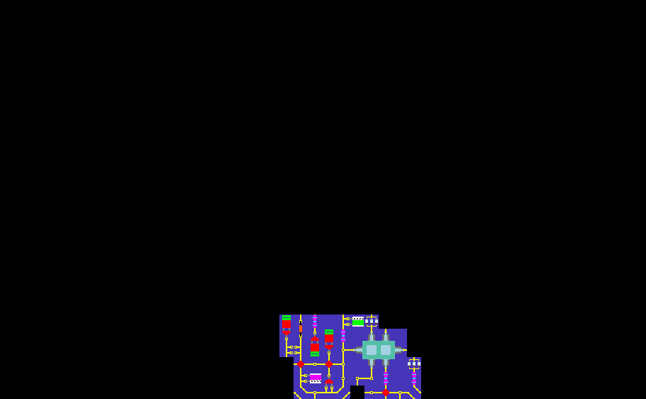

Wave Function Collapse

Based on [https://www.youtube.com/watch?v=rI_y2GAlQFM](https://www.youtube.com/watch?v=rI_y2GAlQFM)

The Wave Function Collapse (WFC) algorithm, inspired by concepts from quantum mechanics, is used for procedural generation, often of images or patterns. Here's a brief overview:

- Define Tiles and Rules: You provide a set of tiles and rules dictating which tiles can be next to each other.
- Initial State: Each tile slot starts with the possibility of having any allowed tile. This is like all possibilities existing simultaneously.
- Collapse: The algorithm iteratively selects a slot with the fewest possibilities and randomly chooses a single valid option for that slot. This "collapses" the possibilities to one, similar to a measurement in quantum mechanics (though not directly analogous).
- Propagate: The chosen tile's constraints are applied to its neighbors, removing any options that become invalid. This "propagates" the consequences of the choice.
- Repeat: Steps 3 and 4 are repeated until a solution is found (all slots have a single valid option) or a contradiction arises (no valid options for any slot), indicating the process needs to backtrack and try a different choice.

WFC works by efficiently exploring the space of possibilities defined by the tiles and rules, ultimately generating an output that adheres to the given constraints.

